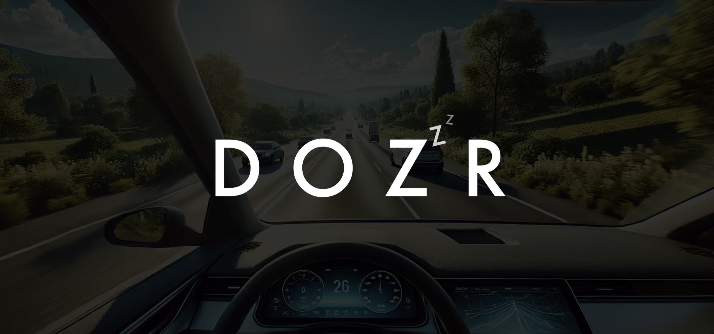
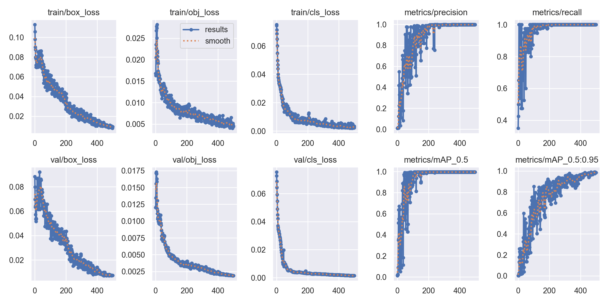
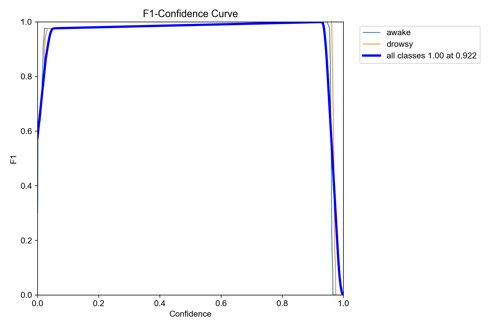

<p align="center">
  
</p>

<h1 align="center">🚦 DOZR 🚦</h1>

<div align="center">

#### Stay Sharp, Drive Smart.


#### Detect driver drowsiness in real-time and stay safe on the road!  
</div>

---

<div align="center">

## 🌟 **Overview**

**Dozr** is a real-time drowsiness detection system designed to enhance road safety by detecting drowsy states in drivers. Built with **YOLOv5**, **PyTorch**, and **OpenCV**, it leverages deep learning and computer vision techniques to trigger alerts and prevent accidents.

---

### **Key Features at a Glance (Potential)**
| Feature                     | Description                                                       |
|-----------------------------|-------------------------------------------------------------------|
| 🕒 **Real-time Detection**  | Uses YOLOv5 to detect drowsiness via webcam.                       |
| 🔔 **Alert System**         | Triggers alerts when drowsiness is detected.                       |
| 🎯 **Custom Training**      | Supports fine-tuning with custom datasets.                         |
| ⚙️ **Compatibility**        | Works on both CPU and GPU for faster inference.                    |
| 📊 **Dashboard (Planned)**  | Interactive dashboard for monitoring and analytics.                |

---


---

## ⚙️ **Installation**

### **Clone the Repository**
</div>

```bash
git clone https://github.com/yourusername/dozr.git
cd dozr
```
<div align="center">

### **Install Dependencies**

</div>

```bash
pip install -r requirements.txt
```
<div align="center">

### **Install YOLOv5**

</div>

```bash
git clone https://github.com/ultralytics/yolov5.git
cd yolov5
pip install -r requirements.txt
```

### **Download Pre-trained Weights**
```bash
wget https://github.com/ultralytics/yolov5/releases/download/v6.0/yolov5s.pt
```

---

<div align="center">

## 📦 **Dataset Preparation**

### **1. Collect Images**
- Capture images for both awake and drowsy states using a webcam.
- Organize them as follows:
  ```
  data/
    images/
    labels/
  ```

### **2. Label Images**
- Use [LabelImg](https://github.com/tzutalin/labelImg) to annotate images.
- Save labels in YOLO format inside `data/labels`.

### **3. Create Dataset Configuration (`dataset.yaml`)**
```yaml
path: ../data
train: images
val: images
nc: 2
names: ['awake', 'drowsy']
```

---

## 🏋️ **Model Training**

### **Train the Model**
```bash
python train.py --img 320 --batch 10 --epochs 500 --data dataset.yaml --weights yolov5s.pt
```

### **Training Parameters**
| Parameter     | Description                         | Default |
|---------------|-------------------------------------|---------|
| `--img`       | Image size                           | 320     |
| `--batch`     | Batch size                           | 10      |
| `--epochs`    | Training epochs                      | 500       |
| `--data`      | Dataset configuration file           | dataset.yaml       |
| `--weights`   | Pre-trained YOLOv5 weights           | yolov5.pt       |

---

## 🚀 **Real-time Detection**

### **Run Detection Script**
```bash
python detect.py --weights best.pt --img 320 --source 0
```

- **source 0:** Webcam input.
- **source path/to/video:** Video input.

---

## 📊 **Results**

</div>

### **Performance Metrics:**
| Metric           | Value           |
|------------------|-----------------|
| **Precision**    | 1               |
| **Recall**       | 0.99715         |

### Training Graphs:

<p align="center">
  
</p>

### F1 Curve:

<p align="center">
  
</p>

---

<div align="center">

## 🔍 **Technologies Used**

| Technology                         | Purpose                                               |
|------------------------------------|-------------------------------------------------------|
| **YOLOv5**                         | Object detection model                                 |
| **PyTorch**                        | Deep learning framework                                |
| **OpenCV**                         | Real-time computer vision                              |
| **LabelImg**                       | Data annotation                                        |
| **Python**                         | Core programming language                              |

---

## 🛠️ **Planned Features**

- **Dashboard:** Interactive dashboard for monitoring drowsiness statistics.
- **Mobile Support:** Companion app for mobile alerts.
- **Enhanced Alert System:** Voice-based alerts and emergency call triggers.

---

## 🤝 **How to Contribute**

We welcome contributions to make **Dozr** even better!

### **Ways to Contribute**
- **Report Bugs:** Found an issue? [Open an issue](https://github.com/yourusername/dozr/issues).
- **Suggest Features:** Share ideas through issues or pull requests.
- **Code Contributions:** Submit pull requests for bug fixes or new features.
- **Improve Documentation:** Enhance this README or other docs.

### **Contribution Steps**
1. Fork the repository.
2. Create a new branch (`git checkout -b feature-name`).
3. Commit your changes (`git commit -m "Description of changes"`).
4. Push to your fork (`git push origin feature-name`).
5. Open a pull request.

---

## **👥 Development:**
This project will be developed by:

| Name                      | Institution             | ID | GitHub | Followers |
|---------------------------|-------------------------|--  |--------|------|
| **Rajin Khan**            | North South University | 2212708042 | [](https://github.com/rajin-khan) |  |
---

⭐ Star the repo if you find it helpful!

---